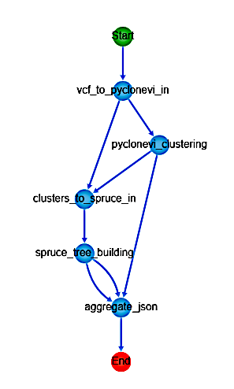
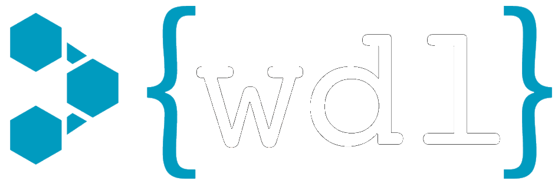

# Parsl for workflow definitions

This repository contains a Parsl implementation of the Phyloflow workflow. The code developed in Parsl is located inside the */parsl* directory. To follow the translation process see [documentation.ipynb](./documentation.ipynb). 

# Workflow Context

## Phyloflow

Phyloflow is a phylogenetic tree calculation tool packaged with Docker and WDL. For more information on Phyloflow, see [github.com/ncsa/phyloflow](https://github.com/ncsa/phyloflow)



---
## 

WDL (Workflow Description Language) is a way to specify data processing workflows. It is used extensively in scientific research focused mainly on Medical and Bioinformatics research. 

A common WDL script is comprised of a series of tasks that are called within a wokflow definition. The data flows within tasks through file dependencies. As an example here is the task for the pyclone-vi task:

<font size="1">

```
task pyclone_vi_clustering{
	input {
		File mutations_tsv
	}

	command {
		sh /code/pyclone_vi_entrypoint.sh ${mutations_tsv}
	}

	output {
		File response = stdout()
		File err_response = stderr()
		File cluster_assignment = 'cluster_assignment.tsv'
	}

	runtime {
		docker: 'public.ecr.aws/k1t6h9x8/phyloflow/pyclone_vi:latest'
	}
}

```

A task specifies the following sections:
* Input: These are files commonly generated by other tasks
* Command: A series of bash statements executed when input dependencies are met
* Output: A definition of all the output files that could be used as dependencies by other tasks
* Runtime: Typically a docker image with all the dependencies needed for the task to run


The WDL code for the whole workflow is detailed in [/workflows/phyloflow_standalone.wdl](./workflows/phyloflow_standalone.wdl). This file specifies five tasks: vcf_transform, pyclone_vi, cluster_transform, spruce_phylogeny and aggregate_json, which are subsequently called inside the phyloflow workflow.

---
## 

*Parsl extends parallelism in Python beyond a single computer*

In the context of workflow definitions for scientific research, Parsl appears in an attempt to unify the flexibility of a complete programming language as Python, along with the ease of use of WDL for parallelizable workflow definitions.

Parsl extends Python's syntax by implementing function decorators for @bash_app and @python_app. Both of these apps return AppFuture datatypes with the promise of execution once their dependencies are met. Apps receive and input array and generate an output array of DataFutures, which are commonly files. AppFutures are the building blocks of Parsl, just as tasks are from WDL. In Parsl, you compose a workflow by defining the output of an App as the input to another App. 

---

# Code Implementation

## Imports


```python
import sys
sys.path.insert(0,'./parsl/')
```


```python
import os
import copy
import json
import shutil
from datetime import datetime
from time import sleep, time
from typing import List

from filesystem_util import (DATA_DIR, LOGS_DIR, ROOT, RUNS_DIR, TEST_DIR,
                             format_files, generate_run_dir, generate_task_dir,
                             generate_workflow_dir, get_stdfiles)
from tasks import *
from testing import *

import parsl
from parsl import bash_app, python_app
from parsl.config import Config
from parsl.data_provider.files import File
from parsl.dataflow.futures import AppFuture
from parsl.executors import ThreadPoolExecutor
```

## Translating WDL Tasks

Every task of the WDL workflow was translated into 3 python functions: parsl app, get_inputs and run.

### App functions

The app function is in charge of running the same code that was originally inside the command section of the WDL task description.


```python
@bash_app
def pyclone_vi(inputs=[], outputs=[], 
               stdout=None, stderr=None):
    return f'''
        conda run -n pyclone-vi pyclone-vi fit --in-file {inputs[0]} --out-file {outputs[0]}
        conda run -n pyclone-vi pyclone-vi write-results-file --in-file {outputs[0]} --out-file {outputs[1]}
        '''
```

### Get inputs functions

The get_inputs function receives AppFutures previously called on the workflow that the app depends on, extracts the outputs needed (DataFutures) and groups them inside an array.


```python
def get_inputs_pyclone_vi(vcf_future:AppFuture):
    inputs = [
        vcf_future.outputs[2]
    ]
    return inputs
```

### Run functions

The run functions receive the inputs and the rundir where all outputs are going to be saved. These functions are in charge of defining the outputs and actually calling the app function.


```python
def run_pyclone_vi(inputs:list, rundir:str) -> AppFuture:
    outdir = generate_task_dir(rundir)
    outputs = [
        'cluster_fit.hdf5',
        'cluster_assignment.tsv'
    ]
    outputs = format_files(outdir, outputs)
    stdout, stderr = get_stdfiles(outdir)
    pyclone_future = pyclone_vi(inputs=inputs, outputs=outputs,
                                stdout=stdout, stderr=stderr)
    return pyclone_future
```

The python code for all the tasks is inside [/parsl/tasks.py](./parsl/tasks.py). 

## Testing

The reasoning behind run functions relying solely on input files, and not AppFutures generated by other apps, is that this modular design allows testing the performance of a single app with test files, without the need to run all the previous steps in the workflow. The unit tests of all the run functions are inside [/parsl/testing.py](./parsl/testing.py), where the test files are taken from the */example_data* directory. 

An example of a test function looks like this:


```python
def test_task(inputs, run_task_func):
    inputs = format_files(DATA_DIR, inputs)
    future = run_task_func(inputs, TEST_DIR)
    print(future)
    future.result()

def test_pyclone_vi():
    inputs = ['pyclone_vi_formatted.tsv']
    test_task(inputs, run_pyclone_vi)
```

## Filesystem Managing

WDL automatically generates a folder structure for the workflow run, as well as a directory for every single task in the workflow. Meanwhile, in Parsl you have to explicitly create a folder structure in order to organize the outputs of your workflow. This translates into greater flexibility for the developer, at the price of needing a better degree of knowledge about the file system. The utility functions for creating the folder structure are defined inside [/parsl/filesystem_util.py](./parsl/filesystem_util.py).

The outputs of the tasks tests go to the */parsl/tests* directory, that contains subdirectories for every test. These subdirectories are overwritten everytime the same test is run. The whole directory tree has the following structure:


```python
! tree ./parsl/tests
```

    ./parsl/tests
    ├── run_aggregate_json
    │   ├── aggregated.json
    │   ├── stderr.txt
    │   └── stdout.txt
    ├── run_cluster_transform
    │   ├── spruce_formatted.tsv
    │   ├── stderr.txt
    │   └── stdout.txt
    ├── run_pyclone_vi
    │   ├── cluster_assignment.tsv
    │   ├── cluster_fit.hdf5
    │   ├── stderr.txt
    │   └── stdout.txt
    ├── run_spruce_tree
    │   ├── spruce.cliques
    │   ├── spruce.merged.res
    │   ├── spruce.res
    │   ├── spruce.res.gz
    │   ├── spruce.res.json
    │   ├── spruce.res.txt
    │   ├── stderr.txt
    │   └── stdout.txt
    └── run_vcf_transform
        ├── headers.json
        ├── mutations.json
        ├── pyclone_samples
        │   └── A25.tsv
        ├── pyclone_vi_formatted.tsv
        ├── stderr.txt
        └── stdout.txt
    
    7 directories, 24 files


The outputs of a complete workflow run goes to the */pars/runs* directory.

## Full Workflow

The workflow function is only responsible for sending the outputs of one execution function as inputs to the other.


```python
def run_workflow(input_file:File, rundir:str) -> AppFuture:
    print(f"\nScheduling Workflow")
    print(f"Input file: {input_file}")
    print(f"Output dir: {rundir}")

    shutil.copy(input_file, rundir)
    inputs = [input_file]
    vcf_future = run_vcf_transform(inputs, rundir)

    inputs = get_inputs_pyclone_vi(vcf_future)
    pyclone_future = run_pyclone_vi(inputs, rundir)

    inputs = get_inputs_cluster_transform(vcf_future, pyclone_future)
    cluster_future = run_cluster_transform(inputs, rundir)

    inputs = get_inputs_spruce_tree(cluster_future)
    spruce_future = run_spruce_tree(inputs, rundir)

    inputs = get_inputs_aggregate_json(input_file, pyclone_future, spruce_future)
    aggregate_json_future = run_aggregate_json(inputs, rundir)
    
    futures = [vcf_future, pyclone_future, cluster_future, 
               spruce_future, aggregate_json_future]
    [print(f) for f in futures]
    return aggregate_json_future
```

Finally, the test workflow function calls the workflow on an example data file and waits for the output


```python
def test_workflow():
    rundir = generate_run_dir(RUNS_DIR)
    inputs = [File('VEP_raw.A25.mutect2.filtered.snp.vcf')]
    inputs = format_files(DATA_DIR, inputs)
    future = run_workflow(inputs[0], rundir)
    print(future)
    future.result()
```

## Running the code

Parsl requires to load a configuration that specifies the computing resources available, and how are they going to be distributed among parsl apps. In this case, a ThreadPoolExecutor is used with 4 as the maximum number of threads. The run_dir is also specified, which corresponds to the directory where all *log* information will be saved.


```python
def load_config():
    config = Config(
        executors=[
            ThreadPoolExecutor(
                label='threads',
                max_threads=4
            )
        ],
        run_dir=LOGS_DIR
    )
    parsl.load(config)

load_config() # Can be called only once
```


```python
test_workflow()
```

    
    Scheduling Workflow
    Input file: /home/alejo/Documents/NCSA/phyloflow_parsl/example_data/VEP_raw.A25.mutect2.filtered.snp.vcf
    Output dir: /home/alejo/Documents/NCSA/phyloflow_parsl/parsl/runs/2023-06-22_10:58:21
    <AppFuture at 0x7efd4996b2d0 state=pending>
    <AppFuture at 0x7efd498d67d0 state=pending>
    <AppFuture at 0x7efd498d71d0 state=pending>
    <AppFuture at 0x7efd498f0550 state=pending>
    <AppFuture at 0x7efd498f1990 state=pending>
    <AppFuture at 0x7efd498f1990 state=pending>


```python
! tree {os.path.join(RUNS_DIR, os.listdir(RUNS_DIR)[-1])}
```

    /home/alejo/Documents/NCSA/phyloflow_parsl/parsl/runs/2023-06-22_10:58:21
    ├── run_aggregate_json
    │   ├── aggregated.json
    │   ├── stderr.txt
    │   └── stdout.txt
    ├── run_cluster_transform
    │   ├── spruce_formatted.tsv
    │   ├── stderr.txt
    │   └── stdout.txt
    ├── run_pyclone_vi
    │   ├── cluster_assignment.tsv
    │   ├── cluster_fit.hdf5
    │   ├── stderr.txt
    │   └── stdout.txt
    ├── run_spruce_tree
    │   ├── spruce.cliques
    │   ├── spruce.merged.res
    │   ├── spruce.res
    │   ├── spruce.res.gz
    │   ├── spruce.res.json
    │   ├── spruce.res.txt
    │   ├── stderr.txt
    │   └── stdout.txt
    ├── run_vcf_transform
    │   ├── headers.json
    │   ├── mutations.json
    │   ├── pyclone_samples
    │   │   └── A25.tsv
    │   ├── pyclone_vi_formatted.tsv
    │   ├── stderr.txt
    │   └── stdout.txt
    └── VEP_raw.A25.mutect2.filtered.snp.vcf
    
    7 directories, 25 files


## Extending the functionality

The original workflow functionality was extended to process multiple input files. For this to work, every workflow run is outputed into a subdirectory of the current run. The output files of all workflows are concatenated using one last @python_app called aggregate_workflows


```python
@python_app
def aggregate_workflows(inputs=[], outputs=[]):
    output_json = []
    for file in inputs:
        workflow_json = json.load(open(file))
        output_json.append(workflow_json)
    output_file = open(outputs[0], 'w')
    output_file.write(json.dumps(output_json))
    output_file.close()


def run_aggregate_workflows(aggregate_json_futures:List[AppFuture], rundir):
    inputs = [f.outputs[0] for f in aggregate_json_futures]
    outputs = [
        'aggregated_workflows.json'
    ]
    outputs = format_files(rundir, outputs)
    aggregate_workflows_future = aggregate_workflows(inputs=inputs, outputs=outputs)
    return aggregate_workflows_future
```

The final parallel workflow implementation is as follows


```python
def run_parallel_workflows(files:List[File], rundir:str) -> AppFuture:
    futures = []
    for idx, input_file in enumerate(files):
        workflow_dir = generate_workflow_dir(rundir, idx)
        workflow_future = run_workflow(input_file, workflow_dir)
        futures.append(workflow_future)
        sleep(0.5)

    print("\nScheduling Workflow Aggregation")
    last_future = run_aggregate_workflows(futures, rundir)
    print(last_future)
    return last_future
```

For demonstration purposes, the test function launches 3 workflows over the same input file


```python
def test_parallel_workflows():
    rundir = generate_run_dir(RUNS_DIR)
    input_file = os.path.join(DATA_DIR, 'VEP_raw.A25.mutect2.filtered.snp.vcf')
    input_file = File(input_file)
    files = []
    for _ in range(3):
        files.append(copy.deepcopy(input_file))

    start = time()
    last_future = run_parallel_workflows(files, rundir)
    last_future.result()
    end = time()
    print("\nAll Workflows Finished !")
    print(f"Elapsed Time: {round(end - start, 2)} [seconds]\n")
```


```python
test_parallel_workflows()
```

    
    Scheduling Workflow
    Input file: /home/alejo/Documents/NCSA/phyloflow_parsl/example_data/VEP_raw.A25.mutect2.filtered.snp.vcf
    Output dir: /home/alejo/Documents/NCSA/phyloflow_parsl/parsl/runs/2023-06-22_10:58:34/run_workflow_0
    <AppFuture at 0x7efd498f35d0 state=pending>
    <AppFuture at 0x7efd4996d9d0 state=pending>
    <AppFuture at 0x7efd4996e7d0 state=pending>
    <AppFuture at 0x7efd4996fb90 state=pending>
    <AppFuture at 0x7efd49969d90 state=pending>
    
    Scheduling Workflow
    Input file: /home/alejo/Documents/NCSA/phyloflow_parsl/example_data/VEP_raw.A25.mutect2.filtered.snp.vcf
    Output dir: /home/alejo/Documents/NCSA/phyloflow_parsl/parsl/runs/2023-06-22_10:58:34/run_workflow_1
    <AppFuture at 0x7efd498f3950 state=pending>
    <AppFuture at 0x7efd498f1010 state=pending>
    <AppFuture at 0x7efd498f0810 state=pending>
    <AppFuture at 0x7efd5b895f90 state=pending>
    <AppFuture at 0x7efd498d7950 state=pending>
    
    Scheduling Workflow
    Input file: /home/alejo/Documents/NCSA/phyloflow_parsl/example_data/VEP_raw.A25.mutect2.filtered.snp.vcf
    Output dir: /home/alejo/Documents/NCSA/phyloflow_parsl/parsl/runs/2023-06-22_10:58:34/run_workflow_2
    <AppFuture at 0x7efd498d5c90 state=pending>
    <AppFuture at 0x7efd486ff450 state=pending>
    <AppFuture at 0x7efd498f0a10 state=pending>
    <AppFuture at 0x7efd48715710 state=pending>
    <AppFuture at 0x7efd48716d50 state=pending>
    
    Scheduling Workflow Aggregation
    <AppFuture at 0x7efd49969a50 state=pending>


# Docker Container


WDL is designed to run every single task in an independent container, so the original phyloflow had different docker images for every task. That is not the case for Parsl, however a workaround was to create multiple conda environments within the same docker container, so that parsl apps can execute the code within the corresponding environment.

Attached to the project is the dockerfile ([/parsl/dockerfile](./parsl/dockerfile)) that contains the definition to build a docker image with all the dependencies that the workflow needs, including the conda environments. The file [/parsl/docker_commands.sh](./parsl/docker_commands.sh) contains docker commands to build the image and run the container. 

The container has been tested on Linux and Mac Systems

# Conclusions

## Parsl Pros

* Parsl gives you finer control over the dependencies
* Parsl provides an easy way to extend workflows using native python functionality
* Parsl workflows are easy to parallelize

## Parsl Cons

* Parsl requieres more knowledge of the filesystem
* It is harder in Parsl to run tasks that have conflicting dependencies
* Retrieving inputs and outputs by indexing an array can get confusing and error prone
